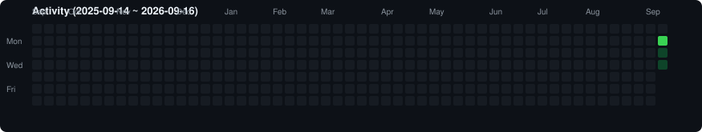
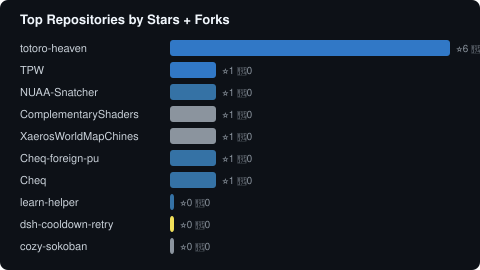

# dboycht

## Tech Stack

Python / TypeScript / Rust / C# / JavaScript / PowerShell / HTML / CSS

## Projects

| Project | Description | Language |
| --- | --- | --- |
| [grownote-ai](https://github.com/dboycht/grownote-ai) | After-school care AI assistant, generates personalized daily feedback for parents | HTML |
| [ContextFlow](https://github.com/dboycht/ContextFlow) | AI coding agent orchestration with cross-session context caching | TypeScript |
| [ClaudeCodeHub](https://github.com/dboycht/ClaudeCodeHub) | Claude Code session manager with persistent storage | TypeScript |
| [NUAA-Snatcher](https://github.com/dboycht/NUAA-Snatcher) | NUAA course enrollment script | Python |
| [ds-usage-export](https://github.com/dboycht/ds-usage-export) | DeepSeek usage data export beyond 30-day UI limit | Python |
| [dsh-plugin-manager](https://github.com/dboycht/dsh-plugin-manager) | DeepSeek Harness plugin manager | JavaScript |
| [opencodeguiplugin](https://github.com/dboycht/opencodeguiplugin) | opencode GUI plugin for VS Code | TypeScript |
| [hostvoice](https://github.com/dboycht/hostvoice) | Main speaker identification and background voice suppression | Python |
| [fake-lockscreen](https://github.com/dboycht/fake-lockscreen) | Windows fake lockscreen with monitor backlight control | Python |
| [SoundMixer](https://github.com/dboycht/SoundMixer) | Virtual microphone mixer with soundboard for Windows | — |
| [ToolboxPanel](https://github.com/dboycht/ToolboxPanel) | Tool and shortcut management panel | Python |
| [NewMenuManager](https://github.com/dboycht/NewMenuManager) | Windows right-click new file menu manager | C# |
| [pswd](https://github.com/dboycht/pswd) | Password manager | Rust |
| [XaerosWorldMapChinese](https://github.com/dboycht/XaerosWorldMapChinese) | Xaero's World Map Chinese localization | — |
| [ComplementaryShadersChinese](https://github.com/dboycht/ComplementaryShadersChinese) | Complementary Shaders V3.4 Chinese localization | — |
| [GitHubDeskChization](https://github.com/dboycht/GitHubDeskChization) | GitHub Desktop Chinese localization | PowerShell |

Full list: [Repositories](https://github.com/dboycht?tab=repositories)

## Charts

### Language Distribution

### Activity Heatmap

### Repository Stats

### GitHub Wrapped

[View 2025 Wrapped →](https://wrapped.run/@dboycht)

## Links

- Bilibili: [dboycht](https://space.bilibili.com/1507021101)
- CSDN: [weixin_54961277](https://blog.csdn.net/weixin_54961277)
- VS Code Marketplace: publisher **dboycht**
